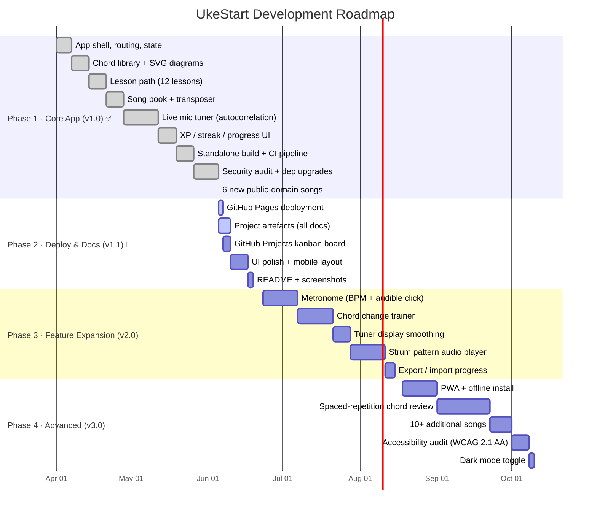

# Gantt Chart — UkeStart

> Rendered by GitHub's Mermaid support. Dates are week-starting Mondays.

---

## Key dates

| Date | Event |
|---|---|
| 2026-06-05 | v1.0 shipped to GitHub; 12 songs, 12 lessons, live mic tuner |
| 2026-06-07 | GitHub Pages live (auto-deploy on push) |
| 2026-06-19 | v1.1 complete — all docs, polished UI, live URL |
| 2026-08-15 | v2.0 complete — metronome, chord trainer, strum player |
| 2026-10-10 | v3.0 complete — PWA, spaced repetition, full polish |

---

## How to read this

- **Green / `done`** — delivered and in `main`
- **Blue / `active`** — in progress this week
- **Grey** — scheduled but not started
- Each bar is one work item. Bars within a section can be done in any order unless there is a clear dependency noted in the epic file.
